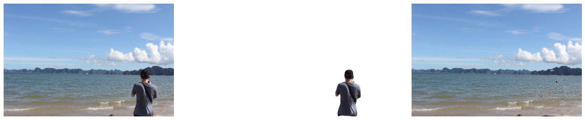

# Mini Photoshop Tool

## Introduction
Mini Photoshop Tool is a free and opensource tool, which make some awesome things with your pictures!

## Features
- Using SOTA models: [U2Net](https://github.com/xuebinqin/U-2-Net) and [LaMa](https://github.com/saic-mdal/lama)
- Support 2 running option: **library** or **web app**
- Support CPU and GPU (default: CPU)
- Support: Background Removal and Object Removal (web app usage)

## TODO
- [] Support batch processing (for library usage)
- [] Post processing for image smoothing
- [] Optimize processing time with large image

## Installation
```bash
pip install mini-photoshop
```

## Library Usage

```python
import cv2
import warnings
warnings.simplefilter('ignore')
from matplotlib import pyplot as plt

from mini_photoshop.model import InpaintModel, SalientModel


device = "cpu"
img_path = "PASTE IMAGE PATH HERE"
# model_name can be "u2net_lite", "u2net", "u2net_human_seg"
salient_model = SalientModel(model_name='u2net_lite', device=device)
inpaint_model = InpaintModel(device=device)

original_image = cv2.imread(img_path)
original_image = cv2.cvtColor(original_image, cv2.COLOR_BGR2RGB)
original_mask = salient_model(original_image)

# Create a copy of the image and set all background values to 255 (white)
bg_removed_result = original_image.copy()
bg_removed_result[original_mask == 0] = 255

inpaint_result = inpaint_model(original_image, original_mask*255)
inpaint_result = cv2.cvtColor(inpaint_result, cv2.COLOR_BGR2RGB)

fig, ax = plt.subplots(nrows=1, ncols=3, figsize=(20, 7))
ax[0].imshow(original_image)
ax[1].imshow(bg_removed_result)
ax[2].imshow(inpaint_result)
for a in ax:
    a.axis("off")
plt.show()
```
<p align="center">
    
</p>

## Web App Usage
Run command
```bash
mini-photoshop
```
and then go to: ***http://localhost:8501/***

<p align="center">
    
</p>

## References
- [U<sup>2</sup>-Net: Going Deeper with Nested U-Structure for Salient Object Detection](https://arxiv.org/pdf/2005.09007.pdf)
- [LaMa: Resolution-robust Large Mask Inpainting with Fourier Convolutions](https://arxiv.org/pdf/2109.07161.pdf)
